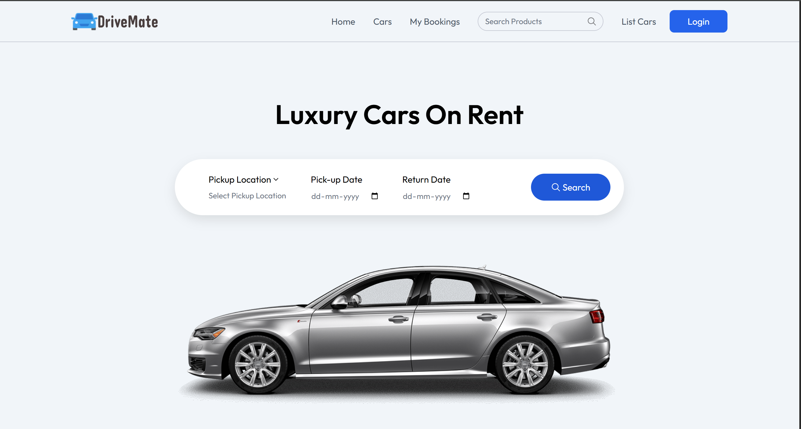
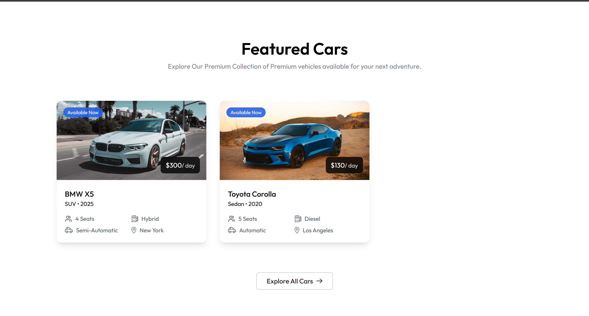
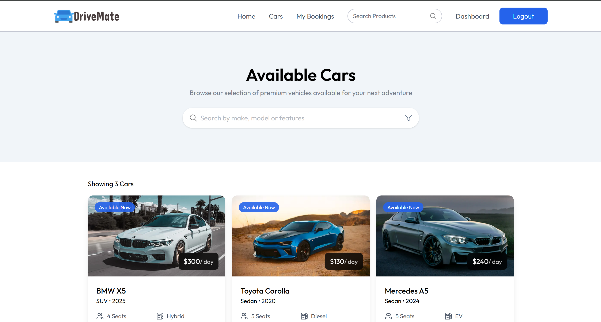
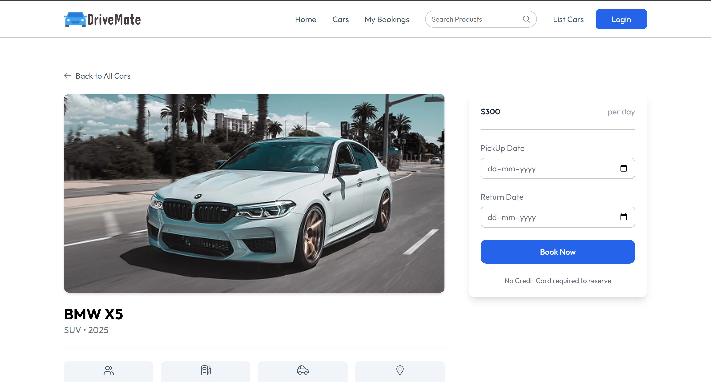
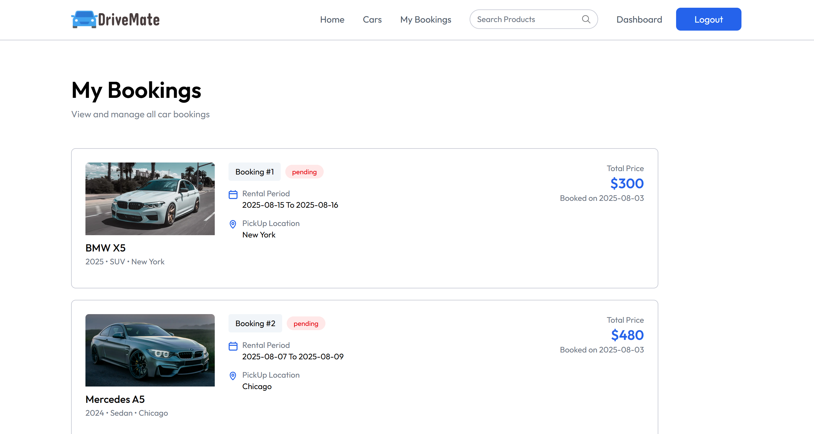
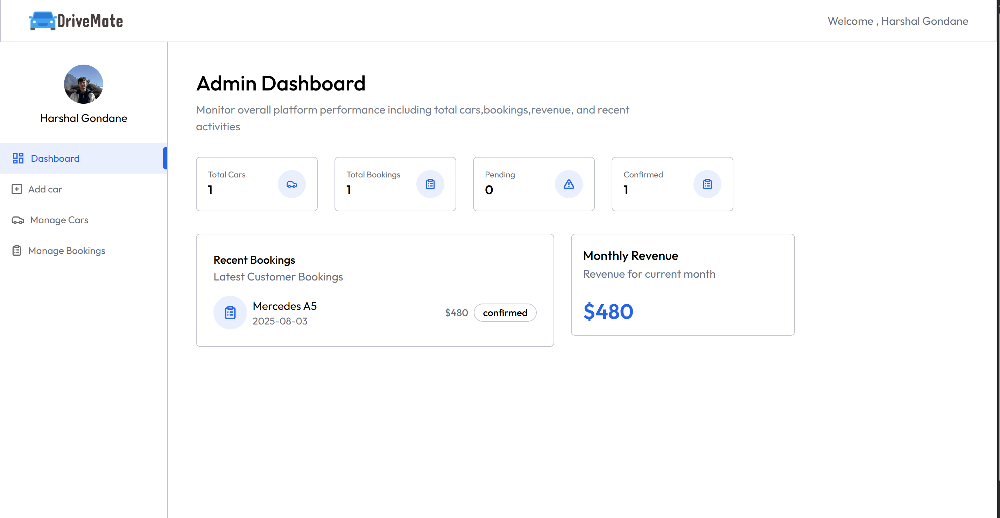
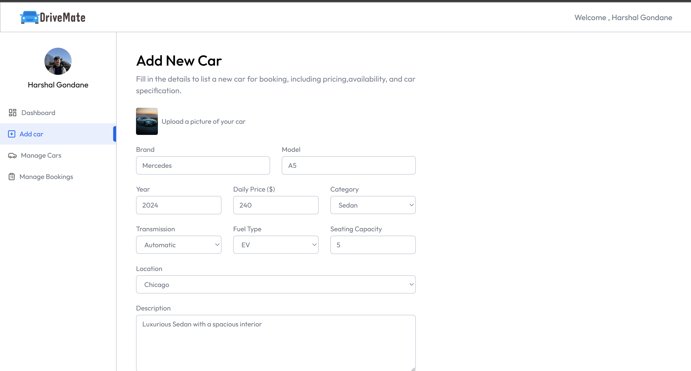
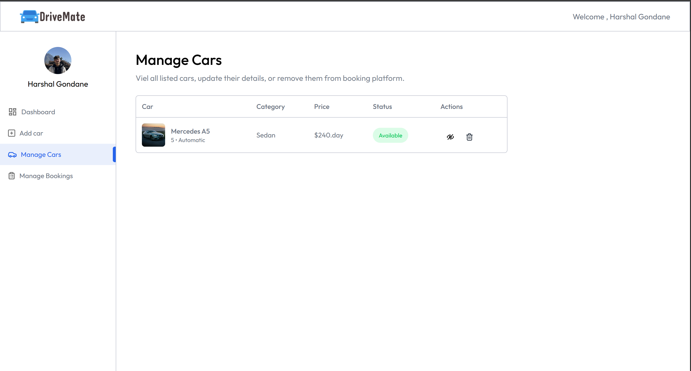
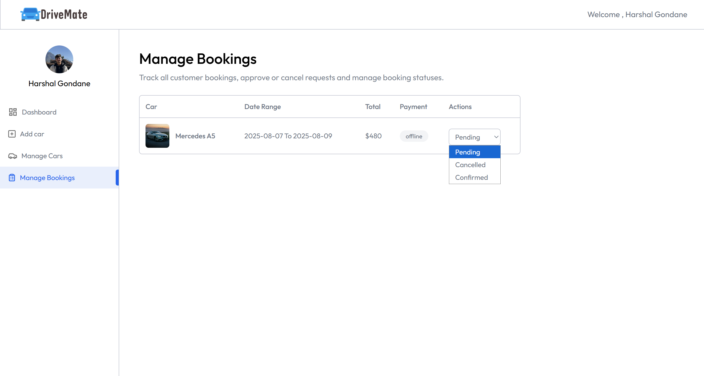

# 🚗 DriveMate - FullStack Car Rental Web Application

DriveMate is a full-stack car rental platform that enables users to browse, book, and manage cars seamlessly, while providing admins with full control over car listings and bookings.

## 🌐 Live Demo

<!-- Uncomment when hosted -->
🔗 [Visit DriveMate](https://drive-mate-lyart.vercel.app/)

## 📁 Repository Structure

```
DriveMate-FullStack/
├── client/         # Frontend (React + Tailwind CSS)
├── server/         # Backend (Node.js + Express + MongoDB)
└── README.md
```

---

## 🛠️ Tech Stack

### Frontend
- React.js
- Tailwind CSS
- React Router
- Axios

### Backend
- Node.js
- Express.js
- MongoDB (Mongoose)
- JSON Web Tokens (JWT)
- Bcrypt.js

---

## 🔐 Features

### 👥 Authentication & Authorization
- JWT-based user authentication
- Role-based access (User / Admin)

### 🚘 For Users
- Browse available cars
- Book and cancel bookings
- View your booking history

### 🛠️ For Admins
- Admin dashboard to manage cars and bookings
- Add / Edit / Delete car listings
- View all user bookings

---

## ⚙️ Setup Instructions

### 1. Clone the repository

```bash
git clone https://github.com/harshalgondane33/DriveMate-FullStack.git
cd DriveMate-FullStack
```

### 2. Setup Backend (Server)

```bash
cd server
npm install
```

- Create a `.env` file in the `server/` directory and add:

```env
PORT=8080
MONGO_URI=your_mongodb_connection_string
JWT_SECRET=your_jwt_secret
```

- Start the server:

```bash
npm start
```

### 3. Setup Frontend (Client)

```bash
cd ../client
npm install
npm start
```

---

## 📸 Screenshots


<div align="center">

  
  
  

  <br/>

  
  
  

  <br/>

  
  
  

</div>

---

## 🙋‍♂️ Author

**Harshal Gondane**  
- 💼 [LinkedIn](https://www.linkedin.com/in/harshal-gondane-bb55bb130/)  
- 💻 [GitHub](https://github.com/harshalgondane33)

---

## ⭐️ Show your Support

If you like this project, consider giving it a ⭐️ on [GitHub](https://github.com/harshalgondane33/DriveMate-FullStack)!

---